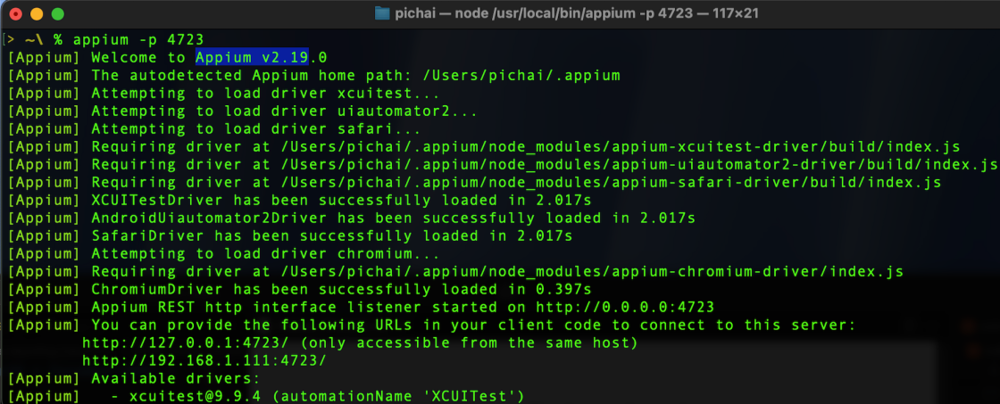
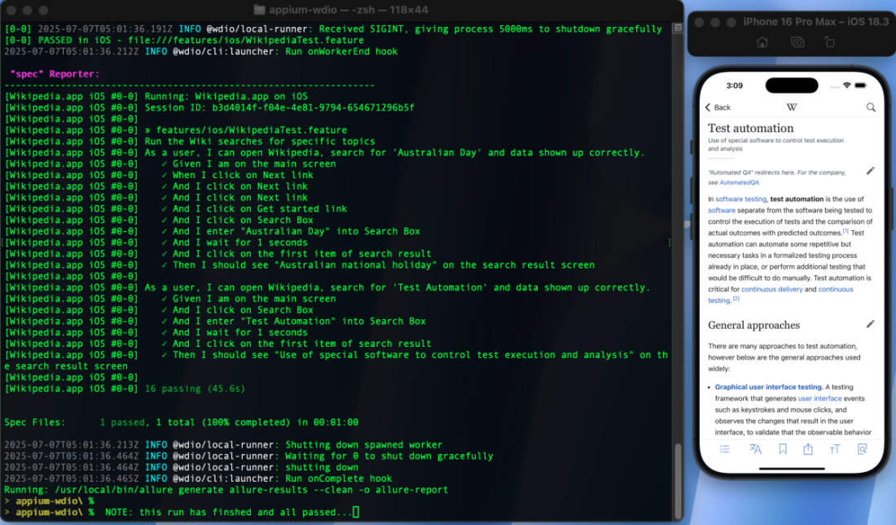
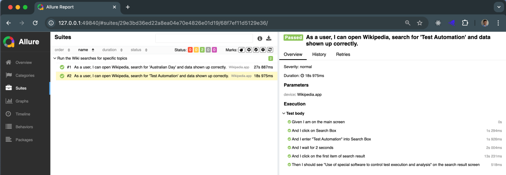
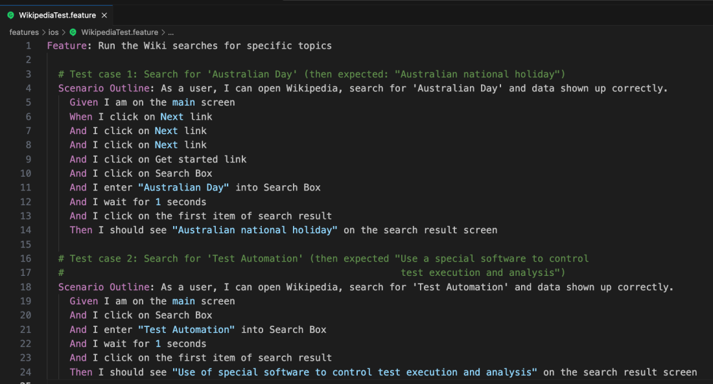

# Mobile E2E Test Suite: Appium + WebdriverIO + Cucumber(BDD) + Allure reporting [JavaScript]

A starter framework for end‑to‑end mobile testing (iOS & later for Android) built with Appium, WebdriverIO, Cucumber BDD and Allure reporting - All in NodeJS platform. Also, using Page Object Model technique.

---

## 📋 Table of Contents

1. [Overview](#1-overview)   
2. [Prerequisites](#2-prerequisites)  💽  
3. [Tools/Helpers](#3-toolshelpers)
4. [Clone & Setup](#4-clone--setup) 🚧   
5. [Configurations](#5-configurations)  
6. [Install Dependencies](#6-install-dependencies)  
7. [Start Appium Server](#7-start-appium-server) 🏃  
8. [Run Tests](#8-run-tests) ✅ 
9. [Generate & Open Reports](#9-generate--open-reports) 📊   
10. [Folder Structure](#10-folder-structure) 📂 
11. [Example of a feature file](#11-example-of-feature-file)
12. [License](#12-license) 🆓  

---

## 1 Overview

This repository contains:

- **Appium** scripts for mobile automation  
- **WebdriverIO** test runner  
- **Cucumber** feature files & step definitions  
- **Allure** for elegant HTML reports  

Use it as a scaffold to write and organize E2E tests for your mobile apps.

## 2 Prerequisites 

- **Node.js** v16+ & npm (or Yarn)  
- **Xcode**, **Xcode Command‑Line Tools** & **Carthage** (for iOS)  
- **Appium Server** v2.19 (globally at MacOS level)  
- **Java JDK** (for Android - later)  
- **Android SDK** + `ANDROID_HOME` environment variable  (for Android - later)

## 3 Tools/Helpers 
- **Appium Doctor** v1.16: to identify any issue with Appium, Drivers, settings or connections 
- **Appium Inspector** v2025.3.1: to find 'locators on mobile devices'

## 4 Clone & Setup
```properties
$ git clone git@github.com:pichai-t/appium-wdio.git
$ cd appium-wdio
```

## 5 Configurations 

wdio-conf.js: iOS capabilities
```js
  capabilities: [
    { // capabilities for local Appium web tests on iOS
      platformName: "iOS",    
      "appium:browserName":"", 
      "appium:deviceName": "iPhone 16 Pro Max",
      "appium:platformVersion": "18.3",
      "appium:automationName": "XCUITest",
      "appium:noReset": false,   // false: reset app state before test.
      "appium:fullReset": false, // false: don't reset the Simulator 
      "appium:app": path.join(process.cwd(),"app/ios/Wikipedia.app"),
    },
  ],
```

## 6 Install Dependencies

```properties
$ npm install
```

## 7 Start Appium Server
>on a separate terminal session, not where you run tests

```properties
$ appium -p 4723
```

So, tests from (another) session of Appium/WebdriverIO can communicate/interact with Application Under Test in iOS devices/Simulator via this 'Appium Server on port 4723'.



## 8 Run Tests

Run everthing:
```properties
$ npx wdio run wdio.conf.js
```

By feature file:
```properties
$ npx wdio run wdio.conf.js --spec ./features/login.feature
```

By Cucumber tag:
```properties
$ npx wdio run wdio.conf.js --cucumberOpts.tagExpression "@smoke"
```

Video of test execution:
[Download a mov file - 1 min video] (https://github.com/pichai-t/appium-wdio/blob/main/assets/vid/appium-run-video-720p.mov) 

Screenshot once tests finished:


## 9 Generate & Open Reports

```properties
$ allure generate allure-results --clean -o allure-report
$ allure open allure-report
```



## 10 Folder Structure 
.
├── app/                       
│   └── android/               # iOS application binarie(s) .app

│   └── ios/                   # Android application binarie(s) .apk

├── features/                   

│   └── android/               # .feature files(BDD) for android tests - later

│   └── ios/                   # .feature files(BDD) for iOS tests

│   └── step-definitions/      # Cucumber step defs

│   └── pageobjects/           # Page Object Models classes

├── allure-results/            # Raw test output

├── allure-report/             # Generated HTML reports

├── wdio.conf.js               # WebdriverIO configurations

├── package.json               # NodeJS's package configurations

└── README.md


## 11 Example of Feature file



## 12 License
This project is licensed under the MIT License.